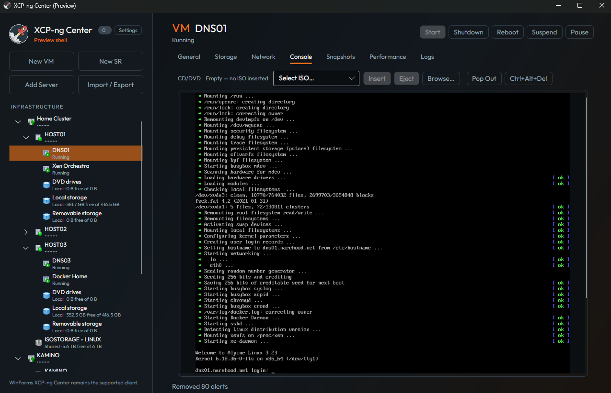

# XCP-ng Center

Windows and Linux management client for [XCP-ng](https://xcp-ng.org) and Citrix® XenServer® environments — manage hosts, pools, storage, and virtual machines.

This repository is actively modernized on the **`development`** branch: .NET 8, calendar versioning, GitHub Actions CI, and an Avalonia UI rewrite that coexists with the production WinForms client.



## Status

| Client | Role |
|--------|------|
| **`XenAdmin`** (WinForms, `net8.0-windows`) | Supported production client |
| **`XcpNgCenter.Shell`** (Avalonia, `net8.0`) | Preview shell — Windows & Linux |

Integration, CI, and releases target **`development`**. Do not revive `origin/avalonia` or old `master-linux*` branches.

Docs:

- [`MODERNIZATION.md`](./MODERNIZATION.md) — runtime, TLS/TOFU, plugins, update banner
- [`UI_REWRITE.md`](./UI_REWRITE.md) — Avalonia shell status and soak notes
- [`CONTRIBUTING.md`](./CONTRIBUTING.md) — how to contribute

## Disclaimer

The official graphical client for XCP-ng is [Xen Orchestra](https://xen-orchestra.com). XCP-ng Center is maintained by community members and hosted by the XCP-ng project.

## What’s shipping

- **Versioning:** `year.month.day.revision` (UTC date; CI sets `BuildRevision` to the GitHub run number)
- **WinForms:** full production feature set (including RDP)
- **Avalonia shell (preview):** connect/TOFU, infrastructure tree, General/Storage/Network, RFB console, Logs, Alerts, Performance graphs, New VM/SR, disk and memory snapshots, comprehensive host/VM properties, clone/copy/migrate/move/delete, validated Import/Export (XVA + OVF/OVA), GitHub Releases update banner, and persisted General/Connection/Display/Security/Confirmations/Privacy settings
- **CI artifacts:** `drop-release` / `drop-debug` (WinForms), `drop-shell-win-x64` / `drop-shell-linux-x64` (Avalonia)

RDP remains WinForms-only for now.

## Getting builds

1. **GitHub Releases** — tagged `vYYYY.M.D.N` (e.g. shell zips / tarballs when attached)
2. **Actions → Test Builds** on `development` — download the artifact you need

### Avalonia shell (local publish)

```bash
dotnet publish XcpNgCenter.Shell -c Release -r win-x64 --self-contained true -p:BuildRevision=1 -o artifacts/shell-win-x64
dotnet publish XcpNgCenter.Shell -c Release -r linux-x64 --self-contained true -p:BuildRevision=1 -o artifacts/shell-linux-x64
```

Shell prefs / TOFU pins:

- Windows: `%APPDATA%\XCP-ng\XCP-ng Center Shell\`
- Linux: `~/.config/XCP-ng/XCP-ng Center Shell/`

## Reporting bugs

Please use the issue tracker. Helpful attachments:

- **Required:** `XCP-ng Center.log` (default `%APPDATA%\XCP-ng\XCP-ng Center\logs\`)
- **Nice to have:** `XCP-ng Center-AuditTrail.log`, `minidump.dmp` (unhandled exceptions only)
- Install PDBs when possible for clearer stack traces

> **Note (builds 25054+):** settings layout changed and does not migrate from older installs. You may need to reconfigure once. That change also enables a portable layout where settings/logs can live next to the executable.

## Building from source

Shared libraries multi-target `net481` + `net8.0`. WinForms app is `net8.0-windows`. Shell is `net8.0`.

```bash
dotnet restore XenAdmin.sln
dotnet build XenAdmin.sln -c Release -p:BuildRevision=1
dotnet test XenCenterLib.Tests/XenCenterLib.Tests.csproj -c Release
```

More detail: the [Building wiki](https://github.com/xcp-ng/xenadmin/wiki/Building) and [`MODERNIZATION.md`](./MODERNIZATION.md).

## Contributions

Fork on GitHub and open a pull request against **`development`**. Discussion also happens on the [XCP-ng forum](https://xcp-ng.org/forum).

## License

BSD 2-Clause. See [LICENSE](LICENSE).

## Maintainers

See [MAINTAINERS.md](./MAINTAINERS.md) and [CREDITS.md](./CREDITS.md).
